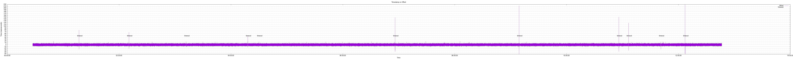

# Building local images 
To build all images (ptp-operator, linuxptp-daemon, kube-rbac-proxy, cloud-event-proxy) to a single personal repository, run the command below.
The command uses a single quay.io repository ans stores the different images as tags:
- `cep` tag: cloud-event-proxy
- `ptpop` tag: ptp-operator
- `lptpd` tag: linuxptp-daemon
- `krp` tag: kube-rbac-proxy  
```
IMG_PREFIX=quay.io/<user>/<repo> make podman-build-all
```

To push all images:
```
IMG_PREFIX=quay.io/<user>/<repo> make podman-push-all
```

To deploy all containers including cloud-event-proxy sidecar:
```
IMG_PREFIX=quay.io/<user>/<repo> make deploy-all
```

# To plot long term ptp4l offset graphs with gnuplot

Run the following command on the cluster running openshift-ptp
```
oc adm must-gather
```

Retrieve the logs corresponding to the linux-ptp-daemon logs
```
must-gather.local.6257239071106258211/
└── quay-io-openshift-release-dev-ocp-v4-0-art-dev-sha256-72ed7cee7798f64a4c30788fd3ef055046357cf95c29bf796be9e39369475141
    └── namespaces
        └── openshift-ptp
            └── pods
                └── linuxptp-daemon-6kmjr
                    └── linuxptp-daemon-container
                        └── linuxptp-daemon-container
                            └── logs
                                ├── current.log
                                ├── previous.insecure.log
                                ├── previous.log
                                └── rotated
                                    ├── 0.log.20250217-072641.gz
                                    ├── 0.log.20250217-103132.gz
                                    ├── 0.log.20250217-133614.gz
                                    └── 0.log.20250217-164056
```

The logs in the "rotated subdirectory are compressed except for the more recent one". 
Unpack all logs with:
```
cd rotated
gzip -d *
```

Concatenate all logs in a single file:
```
cat 0.log.*  | sort -k1,1 > alllogs.txt 
```

Create a csv file with timestamps and offset value:
```
./scripts/getoffset.sh alllogs.txt offset.csv 
```

Edit the ./scripts/plot.gp file to use the offset.csv input csv, then render the graph:
```
gnuplot plot.gp
```

Output graph should be similar to:
